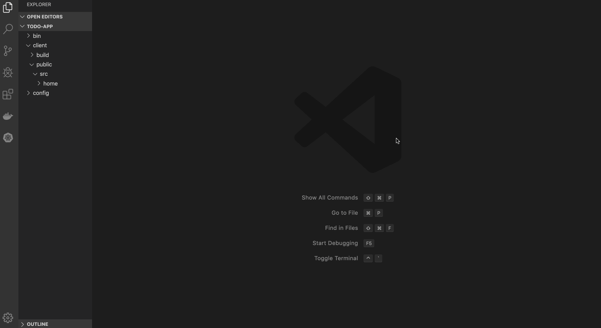
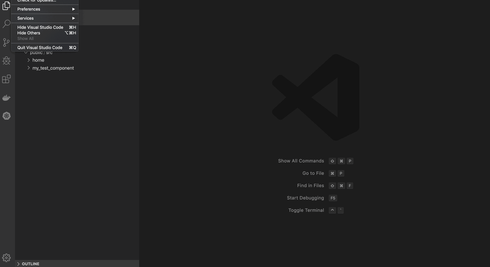
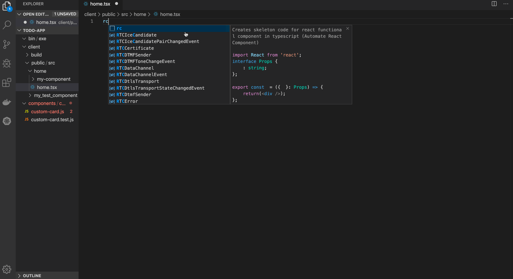
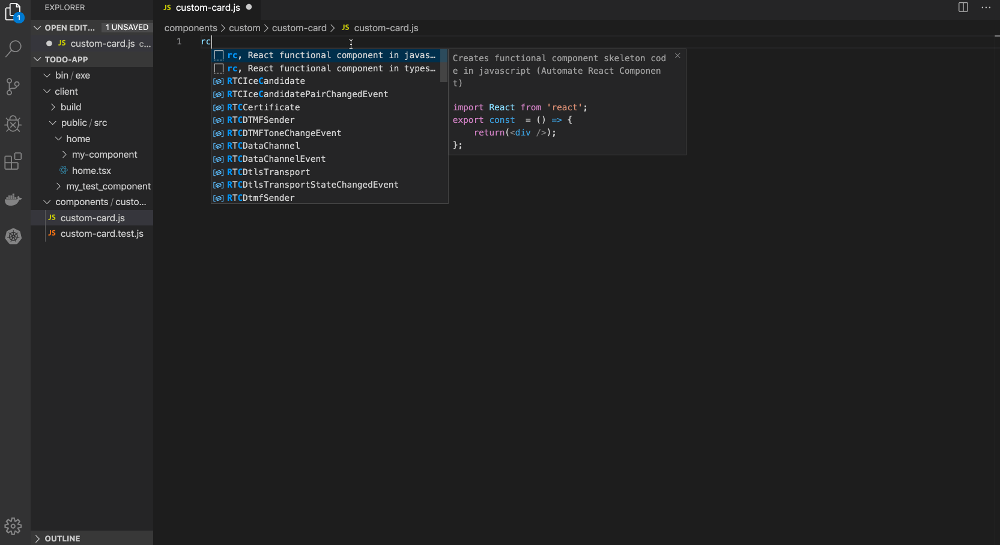
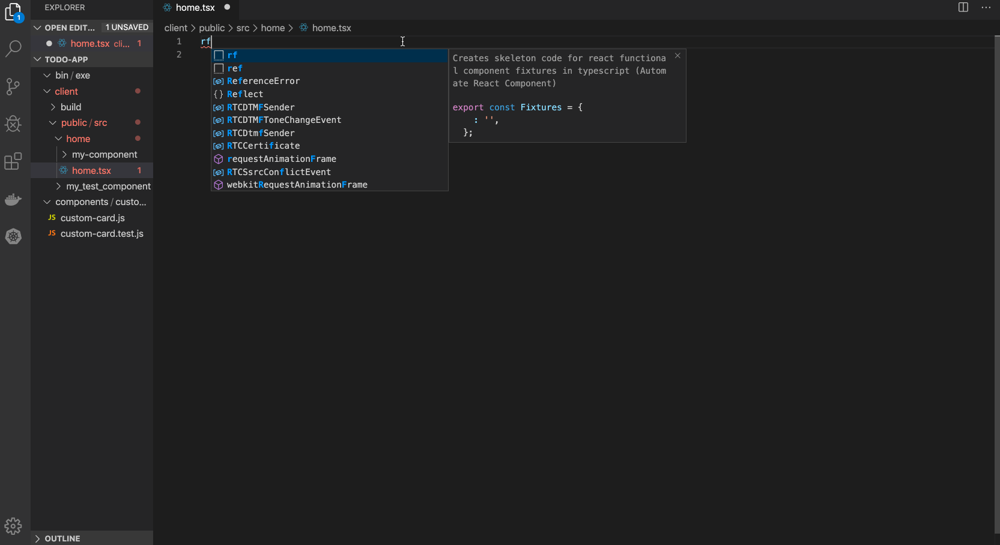
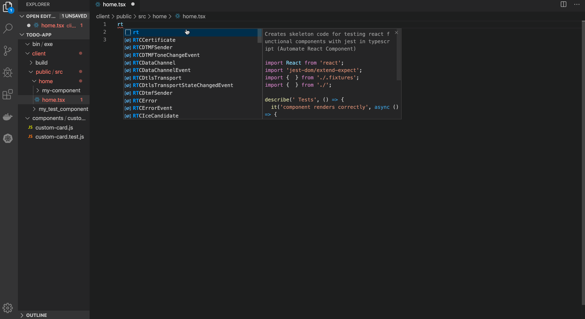
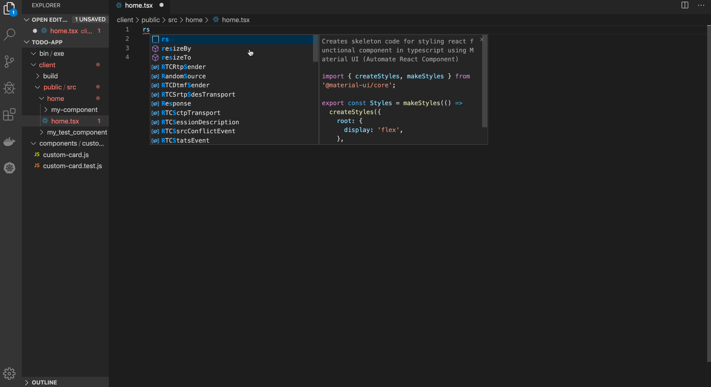

# Automate React Component

Automate-react-component is a vscode extension that creates a react component with all necessary files with skeleton code. This extension provides a handy way to create new react components in your project without the hassle of copy-pasting code from other places.

## Features

### Creating a **default** react component

Demo for creating `test-component-card` react component under `client/public/src` folder of the project:



### Creating a **custom** react component

Demo for creating `custom-card` react component with `custom-card.js` and `test.js` file under newly created folders `components/custom/`:



### Snippets

Demos to use react code-snippets in your project files:

#### React functional component (in typescript/javascript)

Command: `rc`





#### React functional component (in typescript)

Command: `rf`



#### React functional component (in typescript)

Command: `rt`



#### React functional component (in typescript)

Command: `rs`



#### Material UI dialog (in typescript)

Command: `md`

## Usage

- Install the extension

There are three ways to activate this extension:

1. ### Shortcut Key:
   - Press `Command/CTRL` + `Shift` + `R`
2. ### Command Pallete:
   - Open command pallete through `Command/CTRL`+`Shift`+`P`.
   - Search and click on `Create React Component`.
3. ### Context menu:
   - Right click on the folder where you want the component to be created
   - Click on the `Create React Component` option.

- Enter your component name e.g. `my-component`.
- In case of shortcut-key and command pallete option, specify the **relative** path from your project root where the newly created component should be placed e.g. `/home/src/components/` will create `my-component` folder with relevant files under `<YourProjectRoot>/home/src/components/`. From the root to `my-component` folder, the extension will automatically create folders if they do not already exist.

### Custom configuration

Follow these steps to create your custom configuration for react component:

1. Open Settings menu through `Preferences > Settings` OR `Command` + `,`
2. Search for **automatereact** and click on `Edit in settings.json` link under **Automatereact: Files** option.

3. Inside `settings.json` type in `automatereact.files` and hit enter. The default file configuration array will be automatically displayed.

4. Add/Remove objects from the `automatereact.files` array.

#### Example

    "automatereact.files" : [
        ...
        {
            fileName: "fn$.ts",
            content: "import Cn$Styles from './fn$.styles';\n console.log("cN$");\n"
        },
        ...
    ]

will create a typescript file (.ts) and replace each occurence of `fn$` with the component name entered by user after running the extension. The **content** will be written inside that file and also each occurence of `Cn$` will be replaced by the **PascalCase** version of component name while `cN$` will replaced by the **camelCase** version.

#### Example Output

Component name entered by user: `my-component`

content of `my-component.ts` file:

```typescript
import MyComponentStyles from "./my-component.styles";
console.log("myComponent");
```

## Development

- Clone the repository from https://github.com/zainsra7/automate-react-component
- Open the project in VSCode:
  - `cd automate-react-component`
  - `code .`
- Press `F5` to compile and run.
- Follow the official API guide to make changes: https://code.visualstudio.com/api/get-started/extension-anatomy

## Release Notes

### 0.1.0

- Added shortcut key and context menu activation for the extension
- Added custom configuration for creating user-defined react component
- Added snippets to create skeleton code for react files in typescript

### 0.0.1

Initial release of automate-react-component

---

## Future Notes

- Get feedback from users / Improve the extension
- Clone this extension for other famous IDE(s) like Intellij, Atom.
